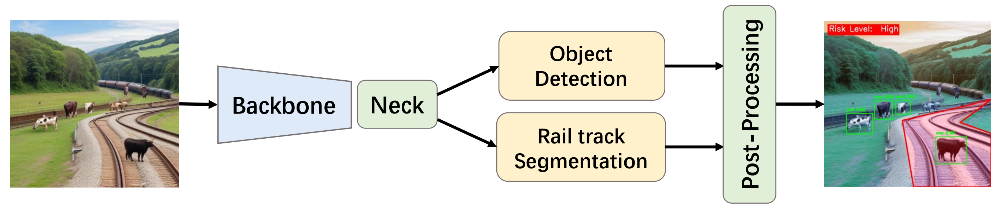

# Real-Time Multi-Task Perception Model for Railway Obstacle Detection 
## The Overview of MTP-Rail




## Requirement

## Install
```python
git clone https://github.com/ultralytics/yolov5  # clone
cd yolov5
pip install -r requirements.txt  # install
```
## Dataset
- **ROD:**
Railway obstacle intrusion dataset. Dowload.
- **BDD100K:**
We uses the same  datasets as <a href="https://github.com/hustvl/YOLOP" title="YOLOP">YOLOP</a>.

We recommend the dataset directory structure to be the following:
```
├─dataset root
│ ├─images
│ │ ├─train
│ │ ├─val
│ ├─det_annotations
│ │ ├─train
│ │ ├─val
│ ├─da_seg_annotations
│ │ ├─train
│ │ ├─val
│ ├─ll_seg_annotations
│ │ ├─train
│ │ ├─val
```

## Training

## Evaluation

## Visualization


